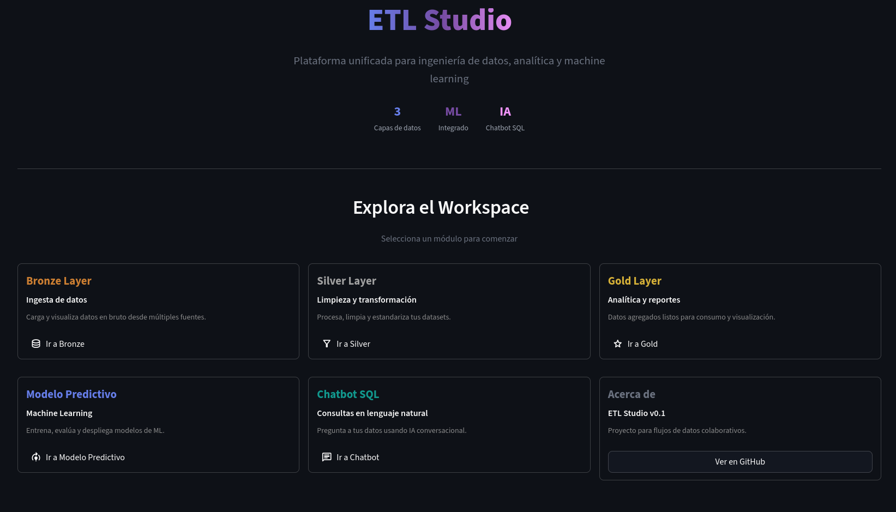

# ETL Studio

**Build & Testing**

[](https://github.com/xMigma/etl-studio/actions/workflows/tests.yml)
[](https://deepwiki.com/xMigma/etl-studio)

---
**Technology Stack**

[](https://streamlit.io/)
[](https://fastapi.tiangolo.com/)
[](https://www.postgresql.org/)
[](https://mlflow.org/)
[](https://www.docker.com/)

Lightweight Streamlit skeleton for a collaborative data platform. This repo only
contains scaffolding so each team member can focus on their layer (ETL, ML, or
UX) without stepping on each other's toes.



## Getting started

### Run with Docker Compose (Recommended)

Start all services (PostgreSQL, API, and Streamlit) with a single command:

```bash
docker-compose up --build
```

This will start:
- **PostgreSQL** on port 5432
- **MLflow Server** on port 5000
- **FastAPI** on port 80
- **Streamlit** on port 8501


Access the applications:

Streamlit UI: [http://localhost:8501](http://localhost:8501)
MLflow UI: [http://localhost:5000](http://localhost:5000)
FastAPI Docs: [http://localhost:80/docs](http://localhost:80/docs)

To stop all services:

```bash
docker-compose down
```

To stop and clean up volumes (reset database):

```bash
docker-compose down -v
```

### Local Development

For local development without Docker:

```bash
python -m venv .venv
source .venv/bin/activate
pip install -e ".[dev]"
streamlit run src/etl_studio/app/main.py
```

### Run the tests

```bash
pytest
```
